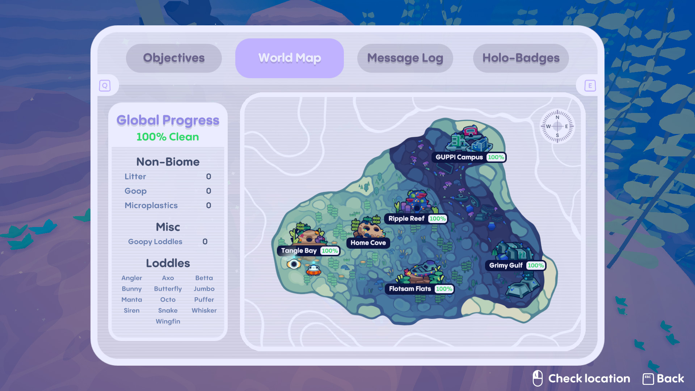

IMPORTANT: This mod is now obsolete as everything it does has been implemented in game updates as of the 1.2.0 update!

# Extra Trackers
A mod for Loddlenaut to add extra global trackers. Currently tracks goop, litter, goopy loddles, and encountered loddle evolutions, plus it gives an overall percentage clean. The menu shows up on the world map when there is no biome selected. Only tested on Windows, but may work on other platforms.

## Installation
Install BepInEx 5 by following the [installation instructions](https://docs.bepinex.dev/articles/user_guide/installation/index.html). You should run the game once to make sure it works and to generate the required files/folders. Then get the dll for this mod from the [releases](https://github.com/paperman5/LoddlenautExtraTrackers/releases) page and put it in the folder `Gameroot/BepInEx/plugins/ExtraTrackers`. If it worked you should see the version number on the title screen.

Note: A previous version of this mod was called GlobalGoopTracker. If you have installed GlobalGoopTracker, please delete it from the `Gameroot/BepInEx/plugins/` folder to prevent conflicts.

## Details
This mod works by adding another `BiomeManager` that tracks all the litter/goop that's not in any other biome. The map in the menu has been altered to show the global cleanup percentage as well as the litter & goop left to collect from non-biome locations - this information will show when there is no other biome selected.

If you find any bugs/problems with this mod, please open an issue or let me know on the Loddlenaut Discord server!
